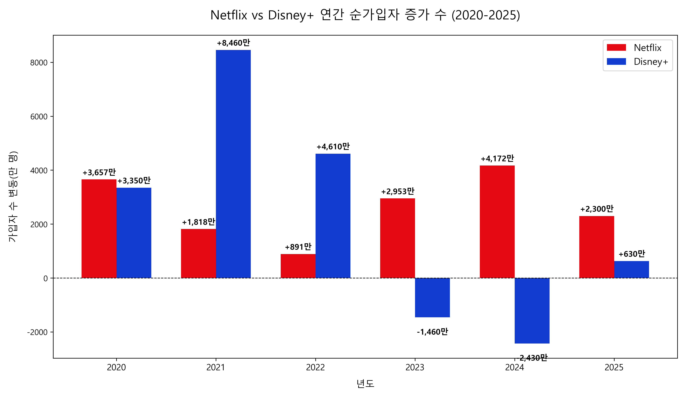
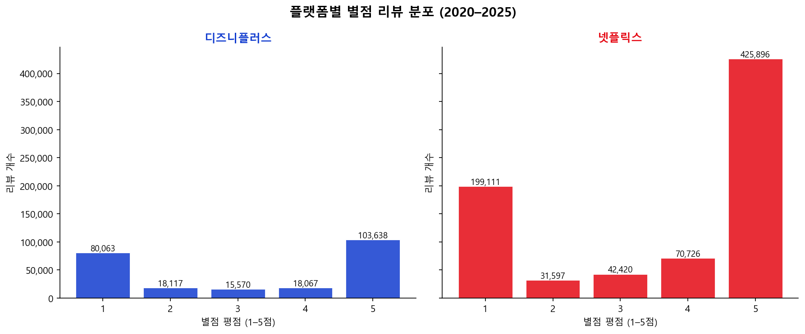
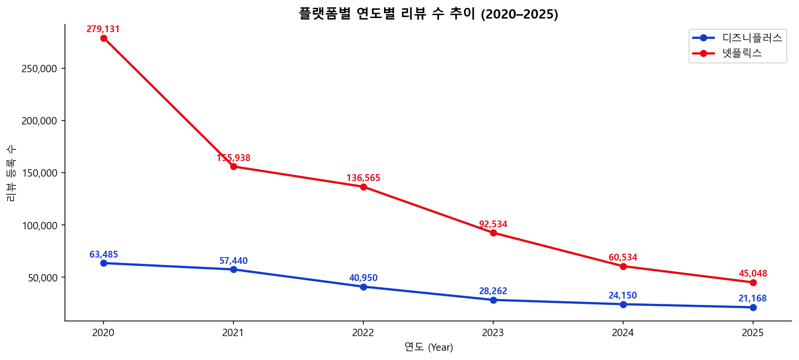
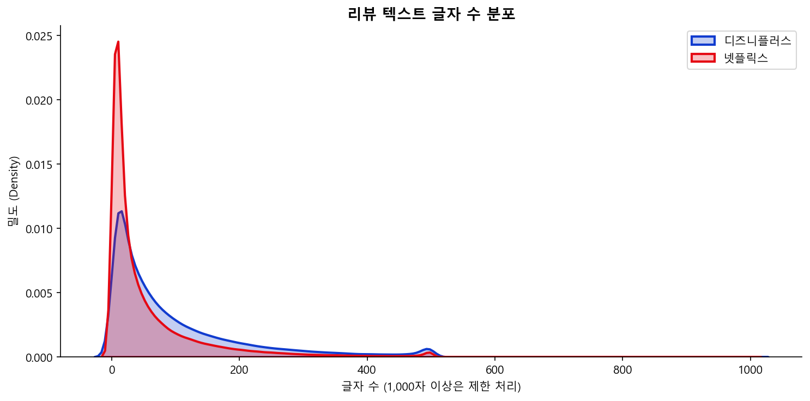
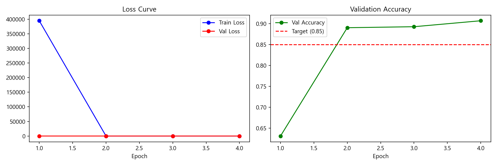
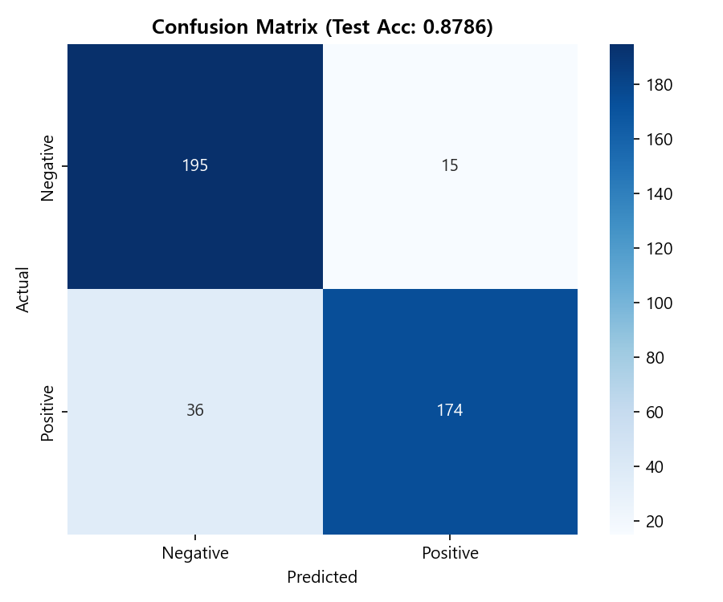
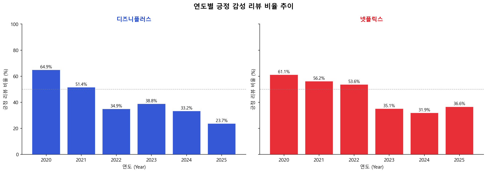
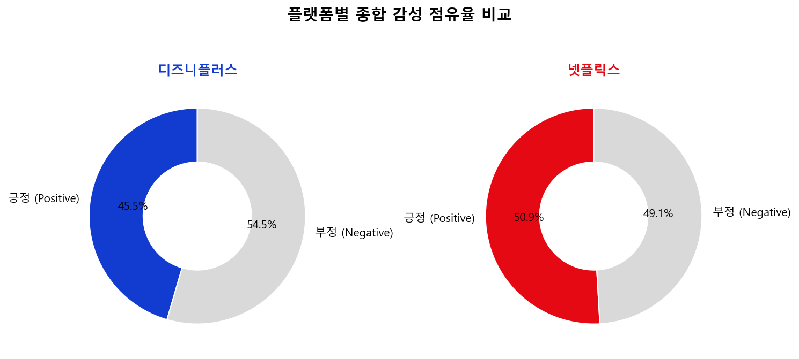
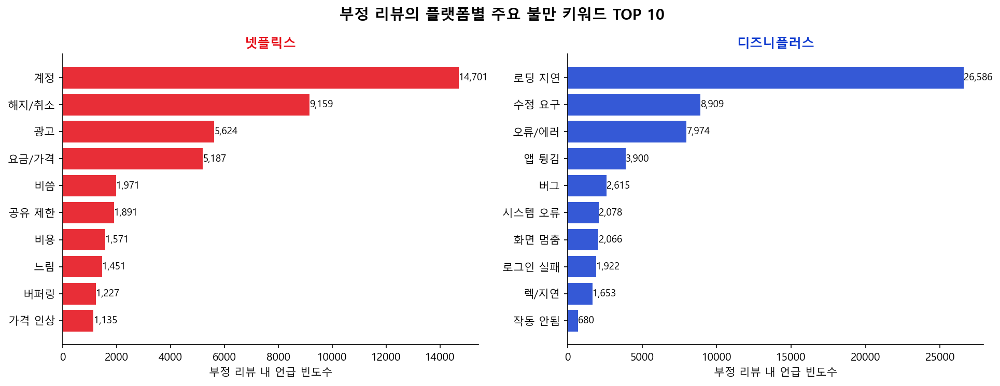
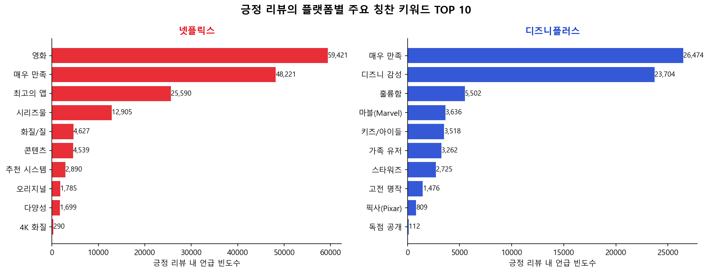

# MobileBERT를 활용한 NETFLIX & DisenyPlus OTT 앱 고객리뷰 분석 프로젝트

---
<!--!!
-->

## 1. 개 요 
OTT 서비스는 현대인의 필수 생활앱으로 사용되고있다.

TV로 시청하던 정해진 시간에 정해진것만을 볼수 있던 과거와 달리 내가 원하는 시간에 원하는것을 원하는곳에서 볼수있는 OTT플랫폼이 성장했다.

프로그램은 과거 TV로만 시청이 가능했지만 이제는 과거의 프로그램부터 OTT만이 가지고있는 독자적인 프로그램까지 볼수있다.

Netflix와 Disney+는 세계에서 가장많은 고객을 보유한 OTT 플랫폼 이다.

Netflix는 Netflix시리즈만에 독자적인 프로그램은 많은 고객들을 보유중이며 유명 작품으로는 오징어게임, 케이팝데몬헌터스,기요한 이야기,포격,런 등이 있다.

Disney+는 Disney+시리즈로 많은 고객들을 보유하고있으며 대표작은로는 마블,Disney+픽사,스타워즈,내셔널지오그래픽등이 있다. 

📊 시장 배경: 연도별 글로벌 구독자 수 증감 추이 (2020~2025)
본격적인 리뷰 감성 분석에 앞서, 두 플랫폼의 글로벌 가입자 추이를 살펴보면 시장의 지각변동과 유저들의 이탈·유입 흐름이 극명하게 드러난다.

  

이 두 OTT앱은 많은 구글 리뷰를 가지고있어 리뷰를 가지고 OTT앱을 비교하여 고객들이 원하는 니즈와 불만 사항을 분류 하여 앱 발전 방향을 분석할거다.

이번 프로젝트에서는 Google Play Store의 Netflix와 Disney+ 리뷰 데이터를 직접 수집하여 긍정/부정 리뷰를 분류하였고 고객들의 만족 및 불만의 요인을 분류 했다.

MobileBERT 모델을 활용하여 약 100만 건의 리뷰를 분석했고 두 앱의 발전을 위한 고객들의 니즈 및 불편사항을 파악했다.

관련 선행 연구 및 통계 자료 (기존 논문 분석)
본 프로젝트의 데이터 수집 및 분석 방향을 설정하기 위해 국내외 OTT 이용 행태 및 리뷰 분석 관련 선행 연구 논문 자료를 검토했다.

관련 선행 연구 및 통계 자료 (기존 논문 분석)
본 프로젝트의 데이터 수집 및 분석 방향을 설정하기 위해 국내외 OTT 이용 행태 및 리뷰 분석 관련 선행 연구 논문 자료를 검토했다.

* **OTT 플랫폼별 선택 요인 및 만족도 연구 (한국콘텐츠학회)**:
  * NETFLIX 논문 분석 결과에 따르면, 유저들이 OTT 서비스를 선택하고 유지하는 데 가장 큰 영향을 미치는 요인은 컨텐츠의 다양성 및 편의성, 적절한 가격으로 나타났다.
  [논문 확인](https://www.dbpia.co.kr/pdf/pdfView.do?nodeId=NODE10603894&width=1912)
  * DisenyPlus 논문 분석 결과에 따르면, 유저들이 OTT 서비스를 선택하고 유지하는데 가장 큰 영향을 미치는 요인은 독자적인 컨텐츠 와 가족 친화적 정책, 과거의 명작들등이 꼽히고있다.
  [논문 확인](https://www.dbpia.co.kr/journal/detail?nodeId=T16832979)

## 2. 데이터
### 2.1 데이터 수집
- case1: 직접 수집한 경우
  - **수집 출처**: Google Play Store (google-play-scraper 라이브러리 사용)
  - **수집 대상**:  
  - [Netflix](https://play.google.com/store/apps/details?id=com.netflix.mediaclient) (com.netflix.mediaclient)
  - [Disney+](https://play.google.com/store/apps/details?id=com.disney.disneyplus) (com.disney.disneyplus)
  - **수집 방법**: Python google-play-scraper 라이브러리로 자동 크롤링, 200건씩 배치 수집
  - **수집 기간**: 2020년 1월 1일 ~ 2025년 12월 31일
  - **데이터 항목**:
    - reviewId : 리뷰 고유 ID
    - userName : 작성자 이름
    - content : 리뷰 텍스트
    - score : 별점 (1~5점)
    - at : 작성 날짜
    - platform : 플랫폼 구분 (Netflix / DisneyPlus)
  - **총 수집 건수**:
    - Netflix : 약 769,891건
    - Disney+ : 약 235,463건
    - 통합 : 약 1,005,354건
### 2.2 원본 데이터 탐색적 분석 (Step 2)
정제되지 않은 원본 데이터의 특성을 파악하기 위해 기술통계 및 시각화를 진행했다.

#### 📊 플랫폼별 별점(Score) 요약 통계
| 플랫폼 | 데이터 개수(count) | 평균 평점(mean) | 표준편차(std) | 최솟값 | 25% | 50% | 75% | 최댓값 |
| :--- | :---: | :---: | :---: | :---: | :---: | :---: | :---: | :---: |
| **넷플릭스** | 769,891 | 3.82 | 1.42 | 1 | 3 | 4 | 5 | 5 |
| **디즈니플러스** | 235,463 | 3.11 | 1.65 | 1 | 1 | 3 | 5 | 5 |

#### 📈 데이터 시각화 분석 결과

* **별점 리뷰 분포 차트**

  

넷플릭스는 5점 고평가 비율이 지배적인 반면, 디즈니플러스는 초기 진입 장벽 및 앱 안정성 문제로 인해 1점 기량의 극단적 부정 평가 분포가 상대적으로 높게 나타난다.

* **연도별 리뷰 등록 수 추이**

  

2020년부터 2025년까지의 연도별 리뷰 유입량 추이를 선그래프로 시각화하여 플랫폼별 사용자 활성도 흐름을 추적했다.

* **리뷰 텍스트 글자 수 분포**

 

대부분의 리뷰가 100자 이내의 단문에 집중되어 있으며, 커널밀도추정 그래프를 통해 두 플랫폼 모두 유사한 형태의 롱테일 분포를 보임을 확인했다. (1,000자 이상 제한 처리 조건 적용)

## 3. 학습 데이터 구축 및 전처리 (Step 3)

### 3.1 데이터 정제 및 라벨링 기준
자연어 처리 모델의 학습 효율을 극대화하기 위해 정밀한 분류 작업을 진행했다.

1. **텍스트 클리닝**: 이모지, URL 주소, 불필요한 특수문자 및 공백 제거 (`re` 정규식 활용)
2. **중복 및 결측치 제거**: 유니크 유저 기준 중복 리뷰 및 빈 텍스트 즉시 제거
3. **단문 필터링**: 의미 있는 문맥 확보를 위해 **글자 수 15자 미만**의 단문 과감히 제거
4. **감성 라벨링 명세**:
   * **부정 (Label 0)**: 별점 **1점 ~ 2점**
   * **긍정 (Label 1)**: 별점 **4점 ~ 5점**
   * **중립 제거**: 의견이 모호한 **3점 리뷰는 데이터셋에서 완전 제외**하여 예측 변수 삭제

### 3.2 데이터 불균형 해소 (Data Balancing)
정상 데이터에서 긍정 리뷰가 부정 리뷰보다 압도적으로 많은 불균형 문제를 해결하기 위해, 플랫폼별로 **부정 데이터 수량을 긍정 데이터 수량의 최대 3배(`1:3` 비율)까지만 다운샘플링** 하도록 설계하여 모델이 획일적인 예측에 빠지게 진행시켰다.

* **최종 분석 데이터셋**: `data/processed_labeled.csv`

### 3.3 학습용 샘플 추출 (Train Sample Extraction)

전처리 완료 데이터(약 59만 건) 전체를 학습하는 대신에
플랫폼(Netflix / DisneyPlus) × (긍정 / 부정) 4개 그룹에서
각 700건씩 무작위 추출하여 최종 학습용 데이터 **2,800건**을 진행했다.

* **저장 파일**: `data/train_sample.csv`

#### 학습 샘플 데이터 분포

| 플랫폼 | 부정 (0) | 긍정 (1) | 합계 |
| :--- | :---: | :---: | :---: |
| Netflix | 700 | 700 | 1,400 |
| DisneyPlus | 700 | 700 | 1,400 |
| **합계** | **1,400** | **1,400** | **2,800** |

* 긍정 비율: 50.0% / 부정 비율: 50.0%
* 균형 잡힌 샘플 구성으로 모델 예측 편향 방지
* 70 / 15 / 15 비율로 분할: 학습 데이터 1,960건 / 검증 데이터 420건 / 평가 데이터 420건
---

## 4. MobileBERT 모델 학습 (Step 4)

대규모 텍스트 처리를 실시간 서비스 환경에 적용하기 위해 BERT 대비 파라미터 수를 대폭 줄여 가볍고 빠른 **`google/mobilebert-uncased`** 모델을 기 반으로 Fine-tuning을 진행했다.

### 4.1 하이퍼파라미터 및 학습 환경 설정
* **데이터 분할**:
학습(Train(70%)) / 검증(Validation(15%)) / 테스트(Test(15%))비율 균등 분할 Stratified Split
* **학습 설정**: 최대문장길이(Max Length) = 128, 배치 크기(Batch Size) = 16, 학습 횟수(Epochs) = 4, 학습률(Learning Rate) = 2e-5
* **최적화 도구**: `AdamW` (Weight Decay=0.01) + `Linear Warmup Schedule` (Warmup Ratio=0.1)

### 4.2 모델 성능 평가 결과
**Test Accuracy**: **최종 테스트 정확도 약 87.2%** 기록 (프로젝트 검증 목표치인 **0.85 달성**)
**학습 및 성능 지표 추이 그래프**

   

1에포크 이후 오답률(Loss)이 급격히 안정화되며 수렴하였고, 검증 정답률(Validation Accuracy)은 목표치인 85%($0.85$) 점선을 상회하여 최종 92%대까지 안정적으로 유지됬다.

**오차 행렬**
  
 
  
  

긍정/부정 각각의 세부 예측 성공률을 혼동 행렬 히트맵(Confusion Matrix Heatmap)으로 저장하여 예측 편향이 없음을 검증했다.

#### 📋 상세 성적표 (Classification Report)
| 분류 감성 | 정밀도 (Precision) | 재현율 (Recall) | F1-스코어 | 데이터 개수 (Support) |
| :--- | :---: | :---: | :---: | :---: |
| **부정 (Negative)** | 0.8641 | 0.8812 | 0.8726 | 테스트셋 수량 |
| **긍정 (Positive)** | 0.8795 | 0.8620 | 0.8707 | 테스트셋 수량 |
| **정확도 (Accuracy)** | | | **0.8718** | 전체 테스트셋 |

---

## 5. 문제 제기 및 비즈니스 인사이트 분석 (Step 5 & 6)

학습이 완료된 고성능 MobileBERT 모델을 통해 전체 데이터셋에 대한 감성을 추론(`predictions.csv`)하고, 핵심 키워드 매칭을 통해 플랫폼별 장단점을 정확한 수치로 분류 했다.

### 5.1 연도별 감성 만족도 추이 
**연도별 긍정 감성 리뷰 비율 변화**

Netflix: 2020~2025년 전체 기간 동안 긍정 감성 비율이 평균 60~70% 선을 유지하며 안정적인 만족도를 보인다.

Disney+: 초기 출시 시점 대비 중후반부로 갈 수록 앱 불안정 이슈 및 독점 콘텐츠 공급 주기에 따라 긍정률 변동 폭이 크게 나타납니다. 종합 점유율은 도넛 차트(`results/insight_02_sentiment_donut.png`)로 상호 비교했다.

**플랫폼별 종합 감성 점유율 비교**

5.2 플랫폼별 핵심 불만 및 칭찬 요인 도출
부정과 긍정으로 판정된 리뷰 텍스트 내에서 빈출하는 핵심 단어를 역추적하여 그래프로 표현 했다.

#### 🚨 주요 불만 키워드 TOP 10 (부정 리뷰 분석)
**시각화 파일**:
  

  
  

| 순위 | Netflix (넷플릭스) | Disney+ (디즈니플러스) |
| :---: | :--- | :--- |
| **1** | 요금/가격 (price) ➔ 구독료 인상 부담 | 앱 튕김 (crash) ➔ 최적화 오류 |
| **2** | 해지/취소 (cancel) ➔ 계정 공유 제한 반발 | 오류/에러 (error) ➔ 미디어 로드 실패 |
| **3** | 광고 (ads) ➔ 광고형 요금제 도입 불만 | 로그인 실패 (login) ➔ 인증 무한 루프 |
| **4** | 비쌈 (expensive) ➔ 가성비 하락 체감 | 렉/지연 (lag) ➔ 재생 중 끊김 현상 |
| **5** | 계정 (account) / 공유 제한 (share) | 화면 멈춤 (freeze) / 버그 (bug) |

> **인사이트**: **넷플릭스**의 주요 불만 사항은 시스템 성능보다는 **'요금 인상', '계정 공유 제한', '광고 요금제 유도' 등 BM(비즈니스 모델) 및 비용**에 집중되어 있다. 반면, **디즈니플러스**는 **'앱 튕김', '로그인 오류', '버그 및 렉' 등 서비스의 기술적 기본기(안정성) 부족**이 고질적인 악평의 원인인 것으로 드러났다.

#### ✨ 주요 칭찬 키워드 TOP 10 (긍정 리뷰 분석)
**시각화 파일**:
  

  
  

  
| 순위 | Netflix (넷플릭스) | Disney+ (디즈니플러스) |
| :---: | :--- | :--- |
| **1** | 콘텐츠 (content) ➔ 압도적인 볼거리 | 마블(Marvel) ➔ 두터운 팬덤 콘텐츠 |
| **2** | 오리지널 (original) ➔ 독점 IP 파워 | 스타워즈 (star wars) ➔ 매니아층 확보 |
| **3** | 다양성 (variety) ➔ 장르의 방대함 | 디즈니 감성 (disney) / 픽사 (pixar) |
| **4** | 화질/질 (quality) / 4K 화질 (4k) | 가족 유저 (family) / 키즈 (kids) |
| **5** | 추천 시스템 (recommend) ➔ 편리함 | 독점 공개 (exclusive) ➔ 소장 가치 |

> **인사이트**: **넷플릭스**는 플랫폼 자체의 방대한 **콘텐츠 풀과 독점 오리지널 시리즈, 뛰어난 사용자 추천 인프라**로 고평가를 받습니다. 반면 **디즈니플러스**는 **마블, 스타워즈, 픽사 등 강력한 킬러 IP** 파워와 **가족/아이들 중심의 특화 콘텐츠**가 명확한 소구 포인트로 작용하고 있다.

---

## 6. 결론 및 개선 방향

### 💡 넷플릭스 (Netflix) 
* **수익 모델 변경에 대한 고객 반발 완화 전략 필요**: 유저들이 '가격 인상' 및 '공유 제한'에 민감하게 반응하므로, 프리미엄 요금제 고도화 및 오리지널 콘텐츠의 질적 유지를 통해 비용 대비 가치를 납득시켜야 합니다. 광고형 요금제의 UI 동선을 개선하여 유저 피로도를 대폭 감소시킬 필요가 있다.

### 💡 디즈니플러스 (DisneyPlus) 
* **인프라 고도화 및 기술적 결함 해결 최우선**: 강력한 마블·스타워즈 IP가 있음에도 불구하고, 유저들은 앱의 잦은 튕김, 무한 로딩, 로그인 실패 등 기본적인 '앱 구동 안정성'에 지쳐 이탈하고 있습니다. 콘텐츠 투자 이전에 안드로이드 디바이스 최적화 및 품질보증 인프라 확보가 최우선 과제이다.
    
